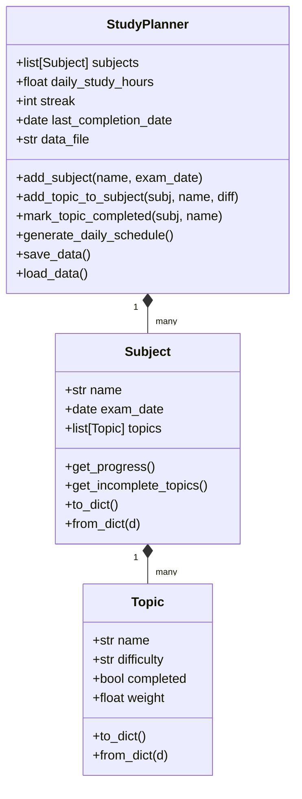

# 📚 Smart Study Planner CLI

A feature-rich, interactive command-line study planner application written in Python using **only standard libraries**. It helps you prioritize subjects with nearest deadlines, estimate preparation workload using difficulty-weighted priorities, track study streaks, and stay organized leading up to exams.

---

## 🚀 Key Features

- **Topic & Subject Management**: Group study materials by subject. Add topics with custom difficulty levels.
- **Deadline-Driven Priority Scheduling**: Automatically generates a daily study schedule based on days remaining until exams and workload. Nearest deadlines get absolute priority!
- **Workload Estimation via Weighted Priorities**:
  - 🟢 **Easy**: 1.0 hour study effort estimation
  - 🟡 **Medium**: 2.0 hours study effort estimation
  - 🔴 **Hard**: 3.0 hours study effort estimation
- **Daily Hours Constraint & Warnings**: Input your daily available study time limit; the system alerts you if your cumulative required daily hours exceed your daily limit.
- **Study Streak Tracking 🔥**: Increases your active streak when you complete tasks day-by-day.
- **Data Persistence**: State is automatically serialized and saved to `study_planner_data.json` inside the directory, ensuring your progress is retained between runs.
- **Aesthetic Terminal Styling**: Styled tables and color-coded statuses (completed, in progress, urgent, overdue) using ANSI escape sequences.
- **Input Validation & Crash Prevention**: Full validation for dates, choices, numeric limits, and empty inputs.

---

## 🛠️ Setup & Installation

### Prerequisites
- Python 3.7 or higher installed on your system.

### Steps
1. Clone the repository (or copy the code files):
   ```bash
   git clone https://github.com/Soutikkk/Smart_Study_Planner_CLI.git
   cd Smart_Study_Planner_CLI
   ```
2. Run the application:
   ```bash
   python study_planner.py
   ```

---

## 📖 How to Use

When you start the application, you'll be greeted with an interactive menu:

```text
============================================================
           📚 SMART STUDY PLANNER CLI 📚
============================================================
No active streak yet. Complete a topic to start one! 🚀
Daily Available Study Hours: 2.0 hrs
============================================================
1. Add Subject & Topics
2. View Subjects & Completion Progress
3. Generate Daily Study Schedule
4. Mark Topic as Completed
5. View Study Statistics
6. Update Daily Study Hours Limit
7. Exit
------------------------------------------------------------
```

### 1. Add Subjects & Topics
Specify a subject name and an exam date in `YYYY-MM-DD` format (e.g. `2026-06-30`). You can immediately append topics to the subject along with their relative difficulty level.

### 2. View Progress
Lists all subjects in a beautiful color-coded ASCII table indicating days left, completion counts, and status:
- `Completed` (Green)
- `In Progress` (Blue)
- `Urgent` (Yellow, if ≤ 3 days left)
- `Overdue` (Red, if exam date has passed)

You can drill down to view specific topics, difficulty levels, and completion status.

### 3. Generate Study Schedule
Automatically prints your daily study schedule. It details:
- Number of remaining topics.
- Estimate hours needed.
- Necessary daily effort (hours/day) to complete all topics before the deadline.
- Recommended study hours allocation fitted to your daily limit.
- Specific focus topics to study today.

### 4. Mark Topic Completed
Pick a subject and topic to mark complete. Completing a topic increments your streak! If you miss a day, the streak resets to 0.

### 5. Statistics & Analytics
Shows comprehensive statistics including progress bar, total/completed topics, active streak, and difficulty breakdown of remaining study items.

---

## 📂 Project Architecture



---

## 🔮 Future Improvements

1. **Flexible Rescheduling**: Implement automated shifting of topics when study hours are missed.
2. **Interactive Study Timer**: Build in a Pomodoro timer directly in the CLI.
3. **Multi-user Support**: Support multiple study profiles.
4. **Data Visualization**: Generate ASCII progress charts or export schedule tables to markdown files or PDFs.
